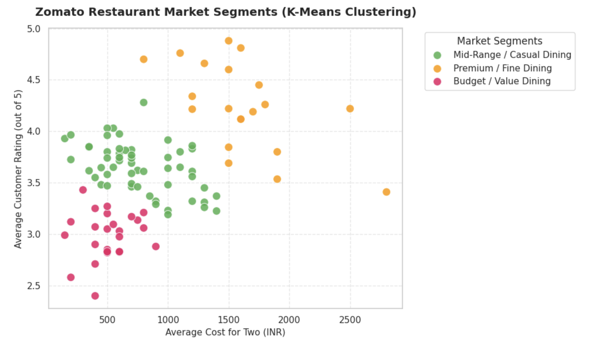
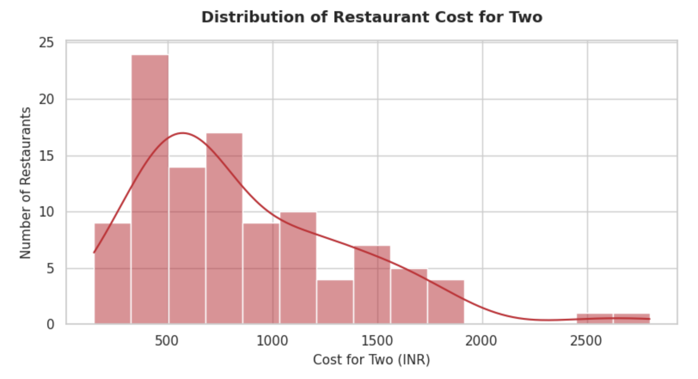

# Zomato Restaurant Market Segmentation (Unsupervised ML)

An end-to-end unsupervised machine learning project analyzing Zomato restaurants using **K-Means Clustering**. The goal is to segment food establishments into distinct target profiles based on customer ratings and average dining costs.

## 📊 Project Overview
* **Data Sources:** 2 merged datasets containing restaurant metadata and over 9,900+ raw customer reviews.
* **Algorithm:** K-Means Clustering.
* **Key Steps:** Text cleaning, numerical extraction, feature scaling (`StandardScaler`), Elbow Method optimization, and data visualization.

## 🎯 The Segments Discovered
Through statistical clustering, we mapped the market into three highly distinct restaurant segments:
1. 🟢 **Budget / Value Dining:** Low average cost (~₹510) and average rating (~2.99/5).
2. 🟡 **Mid-Range / Casual Dining:** Mid-tier cost (~₹767) with good customer rating (~3.65/5).
3. 🔴 **Premium / Fine Dining:** High average cost (~₹1,612) paired with excellent customer rating (~4.24/5).

## 📈 Visualizations
### 1. Market Segmentation Scatter Plot

### 2. Cost Distribution Across Restaurants

